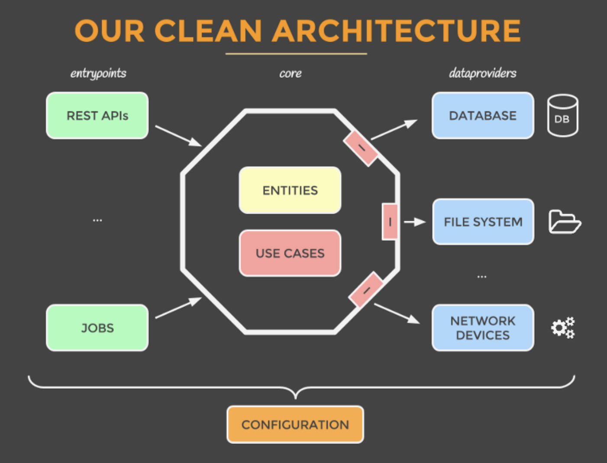
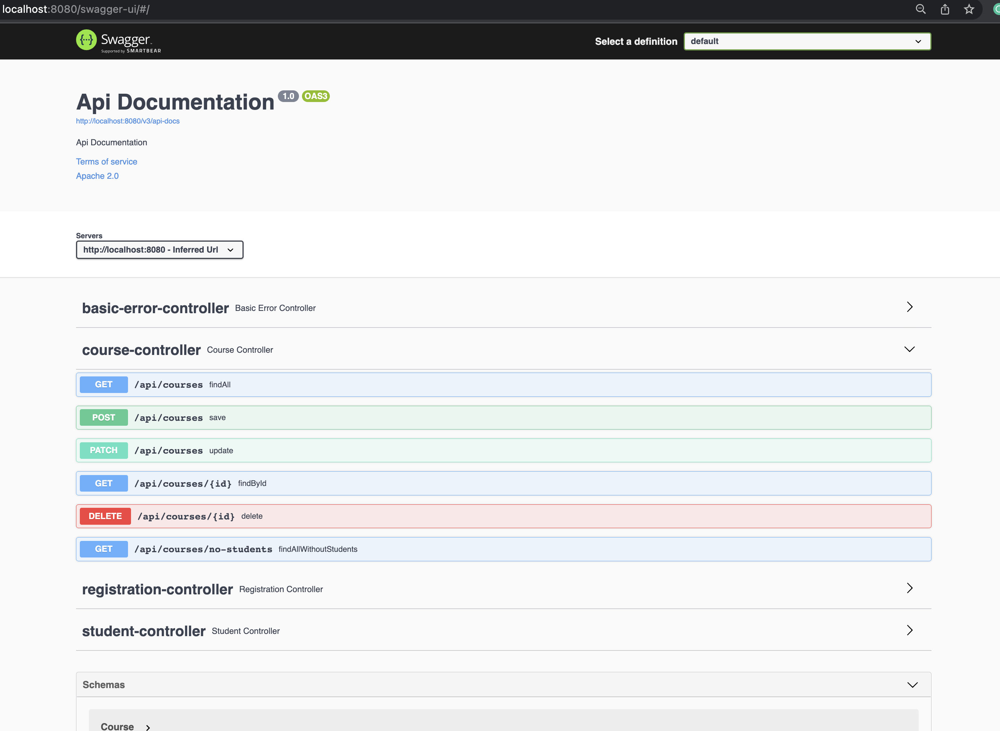
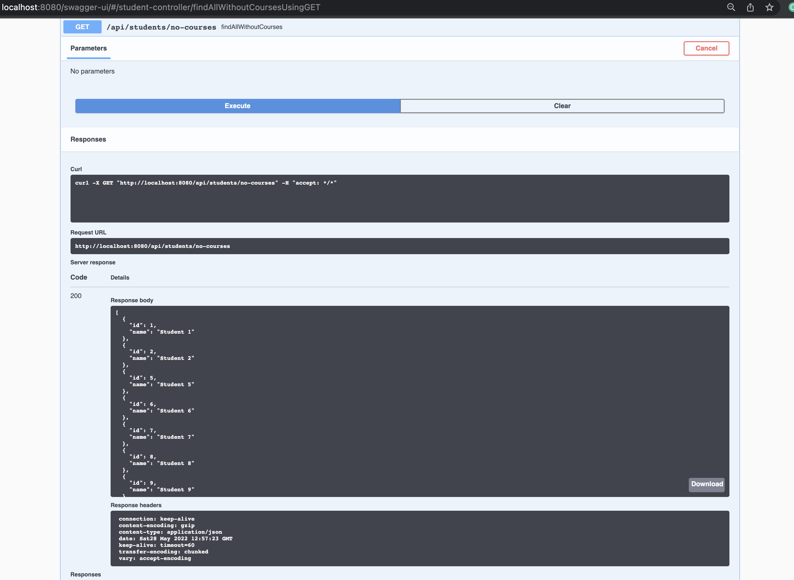

## Running Registration app with Spring Boot



## Steps to Run the Spring Boot ( Must have Docker installed )

1. **Clone the application**

    ```bash
    git clone https://github.com/setembrinolusa/metadata.git
    cd metadata
    ```

2. **Run the app**

    You can run the app by typing the following command

    ```bash
    docker-compose up
    ```

    The server will start on port 8080.

## Steps to Access the app documentation

Go to the <http://localhost:8080/swagger-ui/>



## Auto inserted rows on startup
```python
MYSQL_DATABASE: regs_db
MYSQL_USER: registration_u
MYSQL_PASSWORD: registration_p
MYSQL_ROOT_PASSWORD: root0808
```

| Tables       | Rows |
|--------------|:----:|
| course       |  5   |
| student      |  10  |
| registration |  3   |

## Courses WITH Students ( or Students WITH Coureses )

```python
    mysql> mysql -u registration_u -p
    mysql> Enter password: `registration_p`
    mysql> use regs_db;
    mysql> select * from registration;
```

| id  | course_id | student_id |
|-----|:---------:|:----------:|
| 1   |     2     |     3      |
| 2   |     3     |     4      |

> Other Courses and Students not Registered should appear in WITHOUT list from swagger
> 

